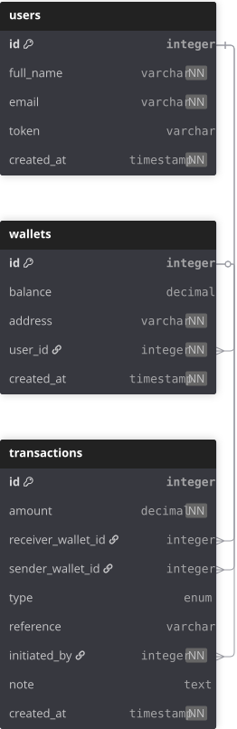

# Demo-Credit-App

Bulus Hamnu's lendsqr Assessment Demo Credit App \
This project is a backend wallet system built as part of a technical assessment for Lendsqr.

The goal was to design and implement a simple MVP that simulates a credit/wallet system, where users can perform core financial operations such as depositing, transferring, and withdrawing funds.

The focus of this project is not on authentication or input validation, but on building a reliable backend system that correctly handles money movement and transaction logic.

Key features include:

- Wallet creation and balance management
- Deposit, transfer, and withdrawal operations
- Transaction recording for all financial activities
- Basic handling of edge cases such as insufficient balance

Tech stack:

- TypeScript
- Node.js
- Knex.js
- MySQL

---

### API Documentation

Link: [Postman Documentation](https://documenter.getpostman.com/view/44782397/2sBXqDs3be)

---

## Database schema design (Improved version)

You can view the ERD diagram here:: [Database Design Diagram](https://dbdiagram.io/d/Demo-Credit-App-69c64721fb2db18e3b1b7bdc)

---

The application uses three main tables: Users, Wallets, and Transactions.

<br>



## Routes Design

### Auth routes

| Method | Endpoint        | Description                  |
| ------ | --------------- | ---------------------------- |
| POST   | `/api/register` | Register a new user          |
| POST   | `/api/login`    | Login and receive faux token |

### Wallet routes

| Method | Endpoint                | Description                            |
| ------ | ----------------------- | -------------------------------------- |
| POST   | `/api/wallets`          | Create a new wallet                    |
| GET    | `/api/wallets`          | Retrieve the user’s wallet and balance |
| POST   | `/api/wallets/deposit`  | Deposit funds into wallet              |
| POST   | `/api/wallets/withdraw` | Withdraw funds from wallet             |
| POST   | `/api/wallets/transfer` | Transfer funds to another wallet       |

### Transaction routes

| Method | Endpoint            | Description               |
| ------ | ------------------- | ------------------------- |
| GET    | `/api/transactions` | Get all user transactions |

## How to Run the Project Locally

- Clone the Repository

```bash
git clone https://github.com/BulusHamnu/demo-credit-app.git
cd demo-credit-app
```

- Install Dependencies

```bash
npm install
```

- Create a .env file

```bash
MYSQL_PASSWORD=your_mysql_password
PORT=3500
DEMO_CREDIT_ADJUSTOR_ID=you_adjustor_project_id
DEMO_CREDIT_ADJUSTOR_API_KEY=your_adjustor_project_api_key
DATABASE_HOST=127.0.0.1_or_your host
DATABASE_ADMIN=database_usernamr
DATABASE_NAME=lendsqr_wallet
DATABASE_PORT=port_number
```

- Run migrations

```bash
npm run migrate
```

- Start development server

```bash
npm run dev
```

## Links:

- [Github Repo](https://github.com/BulusHamnu/demo-credit-app)
- [Live Preview](https://bulus-lendsqr-be-test.onrender.com)
